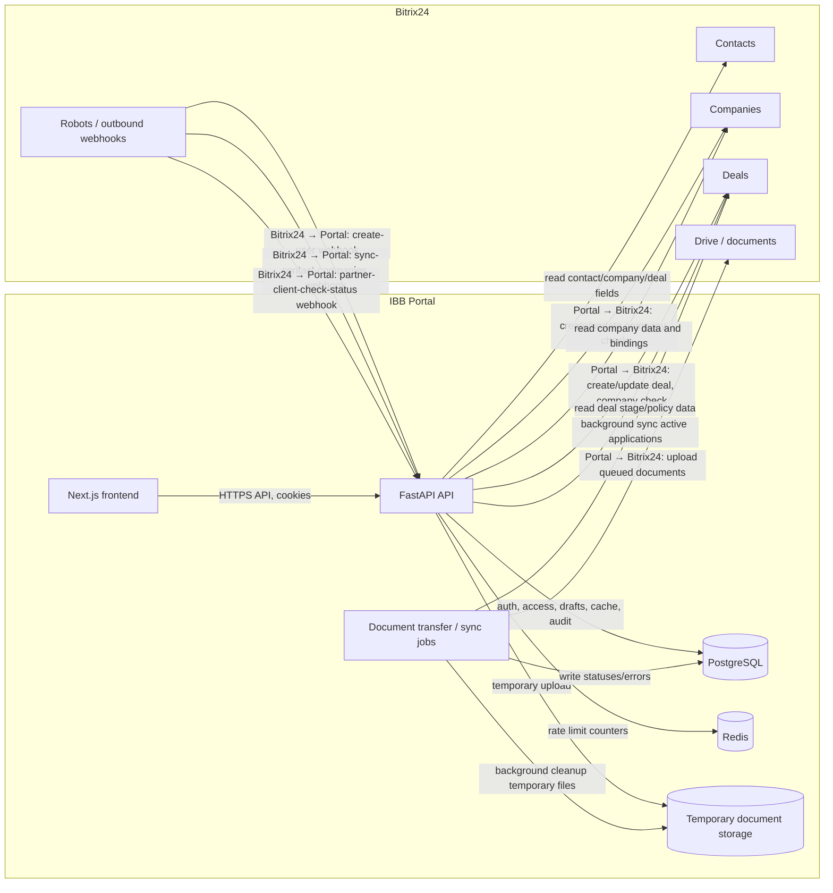
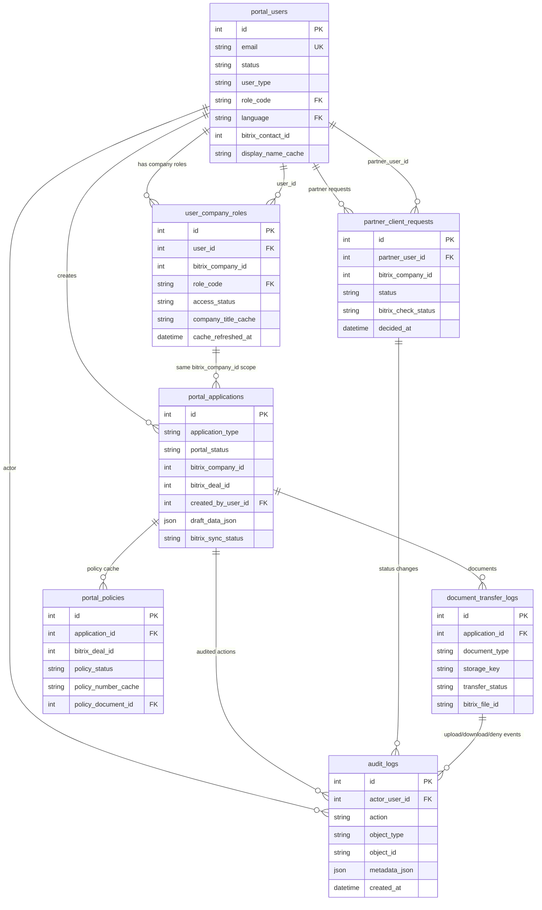

# Анализ проекта IBB Insurance Portal: структура, связи и бизнес-логика

Документ описывает ответственность директорий, основные связи между слоями и то, как в проекте построена бизнес-логика. Анализ выполнен по текущему состоянию репозитория.

## 1. Назначение системы и границы ответственности

IBB Insurance Portal — клиентско-партнёрский портал для страховых процессов. Ключевой архитектурный принцип: портал не должен превращаться во вторую CRM. Bitrix24 остаётся источником истины для компаний, контактов, сделок, полисов, документов, стадий обработки, внутренних комментариев и работы операторов.

Портал хранит только технически необходимое состояние:

- учётные записи, роли, сессии и токены;
- связи пользователей с Bitrix24-компаниями;
- партнёрские связи и заявки партнёров на проверку клиентов;
- черновики заявок и безопасные статусы синхронизации;
- временные метаданные документов и журнал их передачи;
- кэш видимых пользователю данных по заявкам и полисам;
- бизнес-аудит действий пользователей и администраторов;
- справочники и маппинги Bitrix24-стадий в статусы портала.

## 2. Верхнеуровневая карта директорий

| Директория / файл | Ответственность | Ключевые связи |
| --- | --- | --- |
| `app/` | Backend на FastAPI: API, бизнес-правила, интеграции, безопасность, БД, почта и фоновые операции. | Подключается из `app/main.py`, использует таблицы из `app/models.py`, настройки из `app/config.py`, миграции из `alembic/`. |
| `app/routers/` | HTTP-контроллеры. Каждый файл отвечает за отдельный бизнес-контур: auth, applications, auto, cargo, documents, policies, partner clients, Bitrix webhooks, superadmin. | Вызывают сервисные функции из `app/auth.py`, `app/security/`, `app/application_submit.py`, `app/document_transfer.py`, `app/bitrix.py`, `app/integrations/bitrix/`. |
| `app/security/` | Авторизационная политика и eligibility-проверки. | Используется почти всеми роутерами, которые читают/меняют компании, заявки, документы и полисы. |
| `app/integrations/bitrix/` | Новый слой клиента Bitrix24: REST-клиент, ошибки, маппинг полей, синхронизация и безопасное логирование. | Используется submit-flow, reverse sync, webhook-flow и админскими интеграционными ручками. |
| `app/scripts/` | Операционные скрипты: seed справочников, проверка i18n, проверка секретов, инвентаризация Bitrix24. | Запускаются локально, в CI или через Docker Compose tools-сервисы. |
| `alembic/` | Миграции схемы PostgreSQL. | Должны соответствовать `app/models.py`; применяются командами `alembic upgrade head` и Docker-сервисом `migrate`. |
| `frontend/` | Next.js-приложение: страницы портала, локализация, клиентский company context, стили. | Работает с backend через `NEXT_PUBLIC_API_BASE_URL`, использует `frontend/messages/*.json`. |
| `frontend/app/` | App Router страницы и компоненты Next.js. | Маршруты визуально соответствуют backend API: заявки, полисы, смена пароля, superadmin, partner clients. |
| `frontend/lib/` | Общие frontend-утилиты: i18n и выбранная компания. | Используется страницами для локализации и выбора контекста компании. |
| `frontend/messages/` | RU/KA словари интерфейса. | Проверяются `frontend/scripts/check-i18n.mjs`; новые пользовательские тексты должны попадать сюда. |
| `tests/` | Backend-тесты бизнес-логики, API, миграций, доступа, интеграций и конфигурации. | Подтверждают access-control matrix, Bitrix sync, auth, applications, documents, policies. |
| `docs/` | Проектная документация, knowledge base, матрица доступа и данный обзор. | Knowledge base задаёт обязательные ограничения по MVP, Bitrix24, логированию и доступу. |
| `.codex/skills/` | Локальные инструкции для задач Codex по этому проекту. | Не участвует в runtime, но задаёт правила разработки: safe logging, секреты, UI, формы, SEO и т.д. |
| `Dockerfile`, `docker-compose.yml`, `Makefile` | Локальная и контейнерная эксплуатация backend/frontend/PostgreSQL/Redis, миграции и seed. | Compose поднимает backend, frontend, postgres, redis, migrate и seed. |
| `pyproject.toml` | Python-зависимости, настройки pytest и ruff. | Определяет backend package `app*`, dev tooling и стиль. |

## 3. Backend-архитектура

### 3.1 Точка входа

`app/main.py` создаёт FastAPI-приложение, настраивает CORS, безопасный request logging, обработчик `AuthError` и подключает все API-роутеры. Это центральная композиционная точка backend.

Подключённые контуры:

- `auth` — вход, logout, refresh, first login, reset/change password, invite;
- `admin_integrations` — ручной запуск синхронизации Bitrix24 и просмотр ошибок;
- `auto_applications` — автостраховые заявки;
- `cargo_applications` — грузовые заявки;
- `applications` — общий список и карточка заявок;
- `bitrix_webhooks` — исходящие webhooks из Bitrix24;
- `company_access` — компании пользователя и админское управление связями;
- `documents` — загрузка, список, удаление и скачивание документов;
- `health` — live/ready проверки;
- `partner_clients` — партнёрские заявки на клиентов;
- `policies` — список и карточка полисов;
- `superadmin` — управление пользователями, связями и интеграционными ошибками.

### 3.2 Модель данных

`app/models.py` описывает SQLAlchemy Core tables. Основные группы таблиц:

1. **Справочники**
   - `roles`, `countries`, `languages`;
   - `product_groups`, `product_types`;
   - `auto_products`, `auto_product_rules`;
   - `portal_statuses`, `bitrix_categories`, `bitrix_stage_mappings`.

2. **Пользователи и доступ**
   - `portal_users` — пользователь портала, тип (`client`/`partner`), роль, язык, Bitrix contact id;
   - `user_company_roles` — доступ клиента к Bitrix24-компаниям и кэш флагов eligibility;
   - `partner_client_links` — связь партнёра с клиентской компанией;
   - `partner_client_requests` — заявка партнёра на проверку/создание клиента.

3. **Заявки и синхронизация**
   - `portal_applications` — черновики и кэш заявок, Bitrix deal/category/company ids, статус, draft JSON;
   - `application_submit_attempts` — попытки отправки заявки в Bitrix24;
   - `integration_errors` — безопасные записи ошибок интеграции.

4. **Документы и полисы**
   - `document_transfer_logs` — временное хранение и статус передачи документов;
   - `portal_policies` — кэш видимой информации о полисах и связь с документом полиса.

5. **Auth и аудит**
   - `invite_tokens`, `auth_tokens`, `user_sessions`;
   - `audit_logs` — бизнес-аудит с безопасной metadata.

### 3.3 Настройки и инфраструктура

- `app/config.py` содержит Pydantic Settings: БД, Redis, JWT/cookies, Bitrix24, SMTP, CORS, frontend URL, TTL токенов, путь временного хранения документов.
- `app/db.py` создаёт SQLAlchemy engine/sessionmaker и dependency `get_db`.
- `app/logging.py` включает безопасный request logging: логируются технические поля, но не request body, cookies, tokens или персональные данные.
- `app/email.py` формирует и отправляет письма приглашения, first login и password reset.
- `app/i18n.py` содержит backend-словарь стабильных сообщений и labels для RU/KA.
- `app/reference_data.py` и `app/seed.py` наполняют обязательные справочники и маппинги.

## 4. Роутеры и бизнес-контуры

### 4.1 Auth (`app/routers/auth.py`, `app/auth.py`)

Auth-контур отвечает за:

- login/logout/refresh;
- текущего пользователя `/auth/me`;
- приглашения `/auth/invites`;
- first login;
- password reset request/confirm;
- change password;
- rate limiting через Redis;
- httpOnly cookie access/refresh tokens;
- хранение refresh tokens только в виде hash;
- audit событий входа, выхода, ошибок и смены пароля.

Бизнес-логика вынесена в `app/auth.py`: hash паролей Argon2, JWT, hash токенов с секретом, генерация токенов, политика пароля, rate limit counters и audit helper.

### 4.2 Компании и доступ (`app/routers/company_access.py`, `app/company_access.py`, `app/security/policies.py`)

Контур доступа определяет, какие компании и объекты доступны пользователю.

Ключевые правила:

- клиент видит только активные `user_company_roles`;
- партнёр не получает клиентские company-role rows через `/me/companies`, его клиентский контур отделён;
- Bitrix24 company id `1817` всегда игнорируется;
- guessed foreign object должен маскироваться как `404`, где это требуется матрицей доступа;
- denied бизнес-действия аудируются.

`app/security/policies.py` — главный policy layer. Он проверяет доступ к company/application/document/policy/search и отделяет роли `client_admin`, `client_executor`, `client_viewer`, `partner`, `superadmin`.

`app/company_access.py` — более простой helper для company ids и базовой проверки company access; новая бизнес-логика доступа в основном должна проходить через `app/security/policies.py`.

### 4.3 Заявки: общий слой (`app/routers/applications.py`, `app/application_submit.py`)

`app/routers/applications.py` предоставляет общий список и карточку заявок. Он объединяет `portal_applications` со статусами, фильтрами и доступными действиями.

`app/application_submit.py` реализует общий submit-flow:

1. проверяет, что заявка в разрешённом статусе (`draft`, `returned_for_revision`, `submit_error`);
2. создаёт запись `application_submit_attempts`;
3. блокирует заявку на время отправки;
4. создаёт или находит Bitrix24 deal;
5. обновляет portal status и Bitrix sync metadata;
6. ставит документы в очередь передачи;
7. при ошибке пишет безопасный код ошибки и создаёт audit/integration metadata без персональных данных.

### 4.4 Авто-заявки (`app/routers/auto_applications.py`)

Auto-контур отвечает за:

- список доступных auto products для выбранной компании;
- validate draft payload;
- save/update draft;
- submit заявки в Bitrix24;
- eligibility по стране компании, стране регистрации, зоне покрытия, роли пользователя и флагам company cache;
- проверку обязательных документов перед submit;
- построение полей Bitrix24 deal для авто.

Заявка сохраняется в `portal_applications` с `application_type = auto`, а детальные поля лежат в `draft_data_json`.

### 4.5 Cargo-заявки (`app/routers/cargo_applications.py`)

Cargo-контур отвечает за:

- reference data для cargo формы;
- validate payload для `single_shipment`, `contract_coverage`, `certificate`;
- save/update/get draft;
- submit в Bitrix24;
- проверку обязательных документов;
- построение Bitrix24 deal fields для грузовой заявки.

Ключевой MVP-ограничитель: портал хранит черновик заявки, но не хранит документы в draft JSON, полные Bitrix payloads, внутренние комментарии, тарифы или комиссии.

### 4.6 Документы (`app/routers/documents.py`, `app/document_transfer.py`)

Документный контур отвечает за:

- загрузку файлов в рамках заявки;
- хранение файла во временном storage;
- запись metadata в `document_transfer_logs`;
- список документов заявки;
- удаление до submit в разрешённых статусах;
- скачивание с проверкой доступа;
- передачу документов в Bitrix24;
- cleanup временных документов.

Файлы не должны становиться постоянным хранилищем портала. После успешной передачи в Bitrix24 портал хранит только metadata и transfer status.

### 4.7 Полисы (`app/routers/policies.py`, `app/integrations/bitrix/sync.py`)

Полисы в портале — это кэш видимых клиенту данных из Bitrix24, а не отдельный источник истины.

`app/routers/policies.py`:

- показывает список полисов в scope пользователя;
- применяет поиск и фильтрацию по доступным компаниям;
- показывает карточку полиса;
- отдаёт metadata документа полиса, если доступ разрешён.

`app/integrations/bitrix/sync.py` обновляет `portal_policies` по Bitrix24 deal payload и policy file id, если стадия/статус означает выданный полис.

### 4.8 Партнёрские клиенты (`app/routers/partner_clients.py`, `app/partner_client_requests.py`)

Партнёрский контур отделён от клиентского доступа.

Флоу:

1. партнёр создаёт заявку на клиента `/partner/clients`;
2. портал создаёт `partner_client_requests`;
3. backend создаёт/обновляет Bitrix24 company check и выставляет статус `pending`;
4. Bitrix24 роботы/операторы меняют статус проверки;
5. webhook возвращает статус в портал;
6. только после `confirmed` можно создать/активировать partner-client link;
7. до подтверждения партнёр не должен создавать заявки за клиента.

`app/partner_client_requests.py` содержит маппинг Bitrix24 status ids в portal statuses, публичное представление заявки и helper создания partner link.

### 4.9 Bitrix24 webhooks и integration admin

`app/routers/bitrix_webhooks.py` принимает исходящие webhook-запросы из Bitrix24:

- создание пользователя из контакта;
- синхронизация компаний контакта;
- обновление статуса partner client check.

Ключевая логика:

- secret в URL обязателен;
- contact company bindings читаются через `crm.contact.company.items.get`, fallback на `COMPANY_ID` допустим только если bindings недоступны;
- компания `1817` фильтруется;
- язык берётся из contact field `UF_CRM_1753957395750`;
- full Bitrix payload, emails, webhook URLs и tokens не логируются.

`app/routers/admin_integrations.py` позволяет superadmin запускать sync active applications, sync одной заявки и смотреть безопасные sync errors.

### 4.10 Superadmin (`app/routers/superadmin.py`)

Superadmin-контур отвечает за:

- список пользователей;
- карточку пользователя;
- изменение роли и типа пользователя;
- создание/отзыв company links;
- обновление Bitrix links;
- просмотр и закрытие integration errors;
- audit всех критичных админских действий.

## 5. Bitrix24-интеграция

В проекте есть два уровня Bitrix24-обёрток:

- `app/integrations/bitrix/client.py` — основной REST-клиент с retry, timeout, обработкой ошибок и валидацией settings;
- `app/bitrix.py` — legacy/compatibility layer с удобными функциями `create_deal`, `get_contact`, `get_company`, `contact_language_from_contact` и т.д.

Центральные маппинги лежат в `app/integrations/bitrix/field_mapping.py`:

- deal fields: portal application id/type/source/channel/sync status/last sync/error;
- contact language field;
- partner client company status field;
- policy fields, часть из которых помечена как TODO и требует live inventory.

Основные интеграционные потоки:

1. **Portal → Bitrix24**: submit auto/cargo заявки создаёт deal, пишет portal fields, затем документы передаются в Bitrix24.
2. **Bitrix24 → Portal**: webhook создаёт пользователей, синхронизирует компании контакта и обновляет partner client status.
3. **Admin Sync**: superadmin запускает синхронизацию активных заявок, Bitrix deal обновляет portal status/cache и policy cache.

## 6. Frontend-архитектура

`frontend/` — Next.js App Router приложение.

### 6.1 Основные директории

- `frontend/app/` — страницы и layout;
- `frontend/app/styles.css` — глобальные стили и визуальная система;
- `frontend/lib/i18n.ts` — загрузка RU/KA словарей и helper `t()`;
- `frontend/lib/company-context.tsx` — выбранная компания пользователя, localStorage и реакция на список доступных компаний;
- `frontend/messages/ru.json`, `frontend/messages/ka.json` — пользовательские тексты;
- `frontend/scripts/check-i18n.mjs` — проверка синхронности ключей словарей.

### 6.2 Страницы

- `/` — домашний dashboard и company context;
- `/applications` — список заявок;
- `/applications/[id]` — карточка заявки;
- `/applications/auto/new` — форма auto заявки;
- `/applications/cargo/new` — форма cargo заявки;
- `/policies` и `/policies/[id]` — полисы;
- `/partner/clients` — партнёрские клиенты;
- `/superadmin/users`, `/superadmin/users/[id]`, `/superadmin/integration-errors` — superadmin интерфейсы;
- `/first-login`, `/forgot-password`, `/reset-password`, `/change-password` — auth UX.

Frontend не хранит бизнес-истину: он получает текущего пользователя, компании, заявки, полисы и документы через backend API. Контекст выбранной компании нужен для создания заявок и фильтрации пользовательского опыта.

## 7. Бизнес-логика по ролям

| Роль | Основная ответственность / права |
| --- | --- |
| `client_admin` | Чтение компаний, создание/редактирование/submit заявок, approve/return_for_revision в рамках активной компании, документы и полисы. |
| `client_executor` | Чтение компаний, создание/редактирование/submit заявок, документы и полисы; не может approve/return_for_revision. |
| `client_viewer` | Только чтение доступных компаний, заявок, полисов и metadata документов; не может создавать/изменять/загружать/скачивать где запрещено. |
| `partner` | Работает через партнёрский scope: партнёрские клиенты, назначенные заявки, ограниченные документы; не получает клиентские company roles. |
| `superadmin` | Управление пользователями, связями, интеграциями и просмотр всех portal-linked объектов для инспекции. |

Решения по доступу должны приниматься не на frontend, а в backend policy layer. Frontend может скрывать кнопки, но backend обязан повторно проверять action.

## 8. Жизненный цикл заявки

```text
Пользователь выбирает компанию
  → frontend открывает auto/cargo форму
  → backend проверяет company access и eligibility
  → создаётся/обновляется draft в portal_applications
  → пользователь загружает документы
  → submit блокирует заявку и создаёт submit attempt
  → backend создаёт/находит Bitrix24 deal
  → portal_applications получает bitrix_deal_id и sync status
  → документы ставятся в очередь передачи
  → Bitrix24 становится бизнес-источником статуса
  → reverse/admin sync обновляет portal status и policy cache
  → пользователь видит актуальные статусы и полисы в портале
```

Важное разделение:

- `draft_data_json` — только portal draft до submit;
- Bitrix24 deal — бизнес-объект после submit;
- `portal_status` — portal-visible статус, полученный из draft-flow или Bitrix stage mapping;
- `portal_policies` — кэш результата из Bitrix24, не самостоятельный полисный реестр.

## 9. Жизненный цикл документа

```text
Загрузка файла
  → проверка доступа к заявке
  → проверка MIME/расширения/размера
  → временное сохранение файла
  → запись document_transfer_logs
  → при submit queue_application_documents
  → process_document_transfer_queue отправляет файл в Bitrix24
  → статус становится sent или retry_required/failed
  → cleanup удаляет временные файлы по правилам
```

Документы нельзя использовать как постоянное файловое хранилище портала. Клиентский доступ к скачиванию всегда проходит через policy layer.

## 10. Локализация

Поддерживаемые MVP-языки: `ru` и `ka`, default — `ru`.

Правила:

- backend использует стабильные error codes и переводит их через `app/i18n.py`;
- frontend использует `frontend/messages/*.json` и `frontend/lib/i18n.ts`;
- язык контакта приходит из Bitrix24 `UF_CRM_1753957395750`;
- нельзя добавлять видимый текст только на одном языке без соответствующих ключей второго языка.

## 11. Логирование, аудит и безопасность

В проекте разделены два журнала:

1. **Технические логи** — request id, method, path template, status, duration, internal ids, error code.
2. **Business audit** — PostgreSQL `audit_logs` для бизнес-критичных действий.

Запрещено логировать:

- request/response body с пользовательскими данными;
- full Bitrix24 payload;
- имена, email, телефон;
- vehicle plate, VIN;
- route, cargo value;
- document filename/content;
- comments;
- tokens, cookies, passwords, webhook URLs.

Секреты должны оставаться в backend env. Frontend получает только переменные с префиксом `NEXT_PUBLIC_`.

## 12. Миграции, seed и справочники

- `alembic/versions/` хранит историю схемы БД;
- `alembic/env.py` подключает metadata из `app/models.py`;
- `app/reference_data.py` содержит обязательные роли, языки, страны, продукты, статусы и stage mappings;
- `app/seed.py` делает idempotent upsert справочников и нормализацию legacy country codes;
- `app/scripts/seed_reference_data.py` — CLI-обёртка для запуска seed.

Изменения в модели должны сопровождаться миграцией и, если нужно, обновлением seed/reference data.

## 13. Тесты и проверки

`tests/` покрывает ключевые контуры:

- health и compose config;
- auth и i18n;
- access-control matrix и authorization policies;
- company access;
- applications, auto, cargo;
- documents;
- policies;
- partner clients;
- superadmin;
- Bitrix client, webhooks, reverse sync;
- migrations and seed;
- external service config.

Рекомендуемые проверки перед merge:

```bash
ruff check .
pytest
npm --prefix frontend run lint
npm --prefix frontend run typecheck
npm --prefix frontend run build
```

## 14. Диаграмма потоков данных



### 14.1 Portal → Bitrix24

- Submit auto/cargo заявки создаёт или находит Bitrix24 deal, записывает portal source/channel/sync fields и связывает `portal_applications.bitrix_deal_id`.
- Создание partner-client request создаёт/обновляет Bitrix24 company check и ставит статус проверки в Bitrix24.
- Передача документов выполняется отдельно от submit: документы сначала ставятся в очередь, затем отправляются в Bitrix24 Drive/документы.

### 14.2 Bitrix24 → Portal

- `create-user` webhook создаёт или переиспользует пользователя портала на основе Bitrix24 contact.
- `sync-contact-companies` webhook обновляет связи пользователя с компаниями по contact-company bindings.
- `partner-client-check-status` webhook обновляет статус партнёрской проверки клиента.
- Contact language читается из `UF_CRM_1753957395750`, техническая компания `1817` всегда исключается из portal scope.

### 14.3 Фоновые синхронизации

- Admin/background sync читает активные Bitrix24 deals, обновляет `portal_applications.portal_status`, sync metadata и кэш полисов.
- Очередь передачи документов обновляет `document_transfer_logs.transfer_status` и retry/error metadata.
- Cleanup временных документов удаляет локальные файлы после успешной передачи или истечения retention window.

### 14.4 Исходящие webhooks

В этом документе термин «исходящие webhooks» означает исходящие из Bitrix24 в портал endpoints `/bitrix/outbound/{secret}/...`. Для портала это inbound HTTP-запросы, но бизнес-источник события — Bitrix24 robots/webhook automation.

## 15. Идемпотентность событий

| Событие | Идемпотентный ключ / критерий повтора | Ожидаемое поведение при повторе | Где фиксировать результат |
| --- | --- | --- | --- |
| Создание пользователя из Bitrix24 | `bitrix_contact_id` и нормализованный email; для партнёра также `user_type=partner`. | Не создавать дубликат `portal_users`; если пользователь уже существует и ещё не активирован, можно выдать новый invite token; если активен — обновить безопасный contact/company cache без сброса пароля. | `portal_users`, `invite_tokens`, `audit_logs`. |
| Синхронизация компаний контакта | `portal_users.bitrix_contact_id` + набор Bitrix company bindings без `1817`. | Повтор должен привести к тому же набору активных/отозванных company roles; существующие links обновляются, отсутствующие в Bitrix могут становиться `revoked` или неактивными по выбранной политике sync. | `user_company_roles`, `audit_logs` на существенные изменения. |
| Создание заявки / submit | `portal_applications.id` и Bitrix field `portal_application_id`. | Повтор submit не создаёт второй deal: сначала искать deal по portal application id; если deal уже создан, обновить локальную связь и sync status. | `portal_applications`, `application_submit_attempts`, Bitrix24 deal portal fields. |
| Передача документов | `document_transfer_logs.id` + `storage_key` + `application_id` + `bitrix_deal_id`. | Повтор не должен создавать неконтролируемые дубликаты: `sent` не отправлять заново; `retry_required/failed` отправлять по retry policy; результат хранить как transfer status/error code. | `document_transfer_logs`, Bitrix24 file id/status metadata. |

Правило для новой разработки: любой endpoint или job, который может быть вызван Bitrix24 повторно, пользователем двойным кликом или retry-механизмом, должен иметь явный idempotency criterion и тест на повторный вызов.

## 16. Стратегия конфликтов данных

### 16.1 Компания удалена или недоступна в Bitrix24

- Bitrix24 остаётся источником истины: если `crm.company.get` возвращает not found / access denied, портал не должен показывать компанию как доступную для новых действий.
- Существующий `user_company_roles` не удаляется физически, а переводится в безопасное состояние (`revoked`, `not_checked` или аналогичный статус по sync policy), чтобы сохранить audit trail.
- Черновики/заявки по такой компании не переносятся автоматически на другую компанию; создание/submit новых заявок блокируется, чтение исторического кэша допускается только по policy layer и без показа технического ID как названия.
- Integration error должен содержать только error code, internal ids и Bitrix company id, без payload и персональных данных.

### 16.2 Контакт сменил компанию

- При sync контакта источник связей — `crm.contact.company.items.get`; поле contact `COMPANY_ID` используется только как fallback.
- Новые компании добавляются как `user_company_roles` с актуальным access status согласно бизнес-правилу; старые связи, которых больше нет в Bitrix bindings, должны быть отозваны или помечены неактивными.
- Компания `1817` игнорируется даже если она приходит как единственная binding/fallback company.
- Уже созданные заявки остаются связанными с исходной `bitrix_company_id`; перенос заявки между компаниями — отдельное админское бизнес-действие, не автоматический sync side effect.

### 16.3 Пользователь имеет несколько компаний

- Множественная компания — штатный сценарий: frontend хранит выбранный company context, backend при каждом create/edit/submit проверяет доступ к конкретной `bitrix_company_id`.
- Списки заявок и полисов строятся по всем активным компаниям пользователя, если фильтр компании не задан.
- Создание заявки без явного company context должно быть запрещено или требовать выбора компании в UI.
- Нельзя подставлять первую компанию автоматически, если это может создать заявку в неверном юридическом контуре.

### 16.4 Одна компания связана с несколькими контактами

- Это штатный B2B-сценарий: несколько пользователей могут иметь active role на одну `bitrix_company_id`.
- Права определяются не фактом связи contact-company, а portal role/access status в `user_company_roles` и policy layer.
- `client_admin`, `client_executor`, `client_viewer` могут видеть одну компанию с разными действиями; denied действия должны блокироваться backend-ом и аудироваться, если матрица требует audit.
- Company title/cache обновляется безопасно и не должен зависеть от конкретного контакта; client-facing название берётся из Bitrix company `TITLE` cache или локализованного fallback.

## 17. Архитектурные решения (ADR)

### ADR-001: почему не используется CQRS

**Решение:** для MVP не вводить CQRS и отдельные read/write модели.

**Причины:**

- MVP-область ограничена заявками, документами, статусами, полисами, доступами и Bitrix24 sync; отдельный CQRS-слой усложнил бы поставку без явной выгоды.
- Bitrix24 уже является внешним source of truth для бизнес-объектов, а портал хранит ограниченное техническое состояние и кэш.
- Access-control и safe logging проще проверить, когда write/read paths проходят через единый policy layer и одну PostgreSQL-схему.

**Последствие:** read endpoints используют SQL-запросы к portal cache tables и policy filters. Если появится тяжёлая аналитика или независимые публичные read models, решение можно пересмотреть отдельным ADR.

### ADR-002: почему выбран SQLAlchemy Core

**Решение:** использовать SQLAlchemy Core tables и явные запросы вместо ORM-доменных объектов.

**Причины:**

- Проекту важны предсказуемые SQL-запросы, явные joins и прозрачные фильтры доступа.
- Таблицы в портале в основном являются техническими records/cache/audit, а не богатой доменной моделью с поведением.
- Core снижает риск неявной lazy-loading логики и случайного раскрытия данных вне policy filters.
- Миграции Alembic напрямую согласуются с table metadata.

**Последствие:** бизнес-правила должны жить в сервисных функциях и policy layer, а не в методах ORM-моделей.

### ADR-003: почему портал хранит только техническое состояние

**Решение:** не дублировать CRM в PostgreSQL; хранить только auth/access/session state, drafts, sync metadata, document transfer metadata, safe cache и audit.

**Причины:**

- Bitrix24 остаётся операционной CRM для компаний, контактов, сделок, полисов, документов, стадий и менеджерской работы.
- Дублирование CRM-данных создаёт риск рассинхронизации и спорного источника истины.
- Минимизация данных уменьшает regulatory/security risk и упрощает safe logging.

**Последствие:** если frontend нуждается в бизнес-данных, они должны приходить из Bitrix24 через контролируемый sync/cache слой, а не через новые CRM-like таблицы.

### ADR-004: почему документы являются временным хранилищем

**Решение:** документы в портале хранятся временно только для передачи в Bitrix24.

**Причины:**

- Bitrix24/страховой процесс остаётся постоянным местом хранения бизнес-документов.
- Локальное постоянное хранение файлов увеличило бы требования к DLP, backup, retention, правам скачивания и удалению персональных данных.
- Временная очередь позволяет пережить retry и сетевые сбои без превращения портала в файловый архив.

**Последствие:** `document_transfer_logs` хранит transfer metadata/status, а cleanup обязан удалять временные файлы согласно retention policy.

## 18. ER-диаграмма ключевых таблиц



Примечание: часть связей с Bitrix24 (`bitrix_company_id`, `bitrix_deal_id`, `bitrix_contact_id`) не является PostgreSQL foreign key, потому что это внешние идентификаторы CRM. Их валидность проверяется интеграционным и policy слоями.

## 19. Последовательность запуска для нового разработчика

### 19.1 Подготовить env

1. Скопировать пример окружения: `cp .env.example .env`.
2. Заполнить обязательные backend-секреты: `DATABASE_URL`, `REDIS_URL`, `JWT_SECRET`, `COOKIE_SECRET`, `POSTGRES_PASSWORD`.
3. Для локального старта без реального Bitrix24 оставить `BITRIX24_ENABLED=false`; для интеграционной среды заполнить `BITRIX24_BASE_URL` + `BITRIX24_WEBHOOK_TOKEN` или корректный `BITRIX24_WEBHOOK_URL`.
4. Для писем заполнить `SMTP_HOST`, `SMTP_PORT`, `SMTP_USERNAME`/`SMTP_USER`, `SMTP_PASSWORD`/`SMTP_PASS`, `SMTP_FROM_EMAIL`/`SMTP_FROM`.

### 19.2 Запустить инфраструктуру

```bash
docker compose up --build postgres redis backend frontend
```

Альтернатива для backend-only разработки:

```bash
python -m pip install -e ".[dev]"
```

### 19.3 Применить миграции

```bash
docker compose run --rm migrate
# или
alembic upgrade head
```

### 19.4 Выполнить seed справочников

```bash
docker compose run --rm seed
# или
python -m app.scripts.seed_reference_data
```

Seed создаёт системные роли, языки, страны, продуктовые справочники, portal statuses, Bitrix categories и stage mappings. Он не должен создавать production-пользователей с известными паролями.

### 19.5 Создать локального superadmin

В проекте нет отдельной production-safe команды bootstrap superadmin. Для локальной разработки можно создать пользователя вручную через Python/SQLAlchemy, используя `app.auth.hash_password`, а не plaintext/hash, сгенерированный вне приложения:

```bash
SUPERADMIN_PASSWORD='<local-strong-password>' python - <<'END_PY'
import os
from sqlalchemy import insert
from app.auth import hash_password
from app.db import create_app_engine, get_sessionmaker
from app.models import portal_users

engine = create_app_engine()
SessionLocal = get_sessionmaker(str(engine.url))
with SessionLocal() as session:
    session.execute(
        insert(portal_users).values(
            email="admin@example.local",
            password_hash=hash_password(os.environ["SUPERADMIN_PASSWORD"]),
            status="active",
            user_type="client",
            role_code="superadmin",
            language="ru",
        )
    )
    session.commit()
END_PY
```

После входа пароль нужно сменить через UI/API. Для shared/staging/prod окружений предпочтительнее отдельный одноразовый bootstrap runbook с секретами из secret manager, а не commit известных credentials.

### 19.6 Настроить Bitrix24

1. Включить `BITRIX24_ENABLED=true` только после настройки валидных credentials.
2. Заполнить webhook base/token или legacy full webhook URL через env, не коммитить их.
3. Проверить inventory полей:

```bash
python -m app.scripts.bitrix_inventory_check
```

4. Убедиться, что используются существующие portal fields и contact language field, а новые `UF_CRM_*` не создаются без inventory.
5. Настроить Bitrix24 robots/outbound webhooks на endpoints `/bitrix/outbound/{BITRIX_OUTBOUND_WEBHOOK_SECRET}/1/create-user`, `/sync-contact-companies`, `/partner-client-check-status`.

### 19.7 Настроить SMTP

1. Заполнить SMTP env variables.
2. Проверить, что `email_enabled` становится true только при непустом `SMTP_HOST` и from-address.
3. Не логировать invite/reset tokens и temporary passwords.
4. Протестировать first-login/password-reset письма на локальном SMTP sandbox или тестовом mailbox.

### 19.8 Создать тестового пользователя

Рекомендуемый путь — через Bitrix24 `create-user` webhook, чтобы одновременно проверить contact lookup, language mapping, company bindings и invite email.

Для backend-only локальной проверки можно использовать superadmin endpoint `/auth/invites`, затем пройти `/first-login` по invite token. Если создаёте пользователя SQL-ом напрямую, обязательно:

- использовать `hash_password`;
- задать `status='active'` только для локального smoke-test;
- создать нужный `user_company_roles` с `access_status='active'`;
- не использовать реальные email/phone/Bitrix webhook secrets в test data.


## 20. Как добавлять новую бизнес-логику

1. Определить источник истины: Bitrix24 или портал. Если это компания, контакт, сделка, полис, документ или стадия обработки — источник истины Bitrix24.
2. Добавить/изменить таблицы только для технического состояния, доступа, кэша или audit.
3. Сначала обновить policy layer, затем роутеры и frontend.
4. Для пользовательского текста обновить RU/KA словари.
5. Для Bitrix24 fields сначала провести inventory и не дублировать существующие `UF_CRM_*`.
6. Не логировать персональные, коммерческие, файловые или секретные данные.
7. Добавить тесты на happy path, denied path и masked 404, если объект чувствительный.
8. Обновить документацию/knowledge base, если меняется бизнес-контракт.

## 21. Основные архитектурные риски и точки внимания

- Не смешивать клиентский и партнёрский доступ: partner scope должен оставаться отдельным.
- Не показывать Bitrix technical company id как название компании; использовать cached title или нейтральный fallback.
- Не использовать Bitrix24 company id `1817` нигде в portal access scope.
- Не расширять `draft_data_json` до CRM-подобного хранилища.
- Не делать frontend единственным местом проверки прав.
- Не добавлять новые Bitrix24 поля без inventory.
- Не превращать `portal_policies` в самостоятельный источник полисов.
- Следить, чтобы temporary document storage очищался и не становился постоянным архивом.
